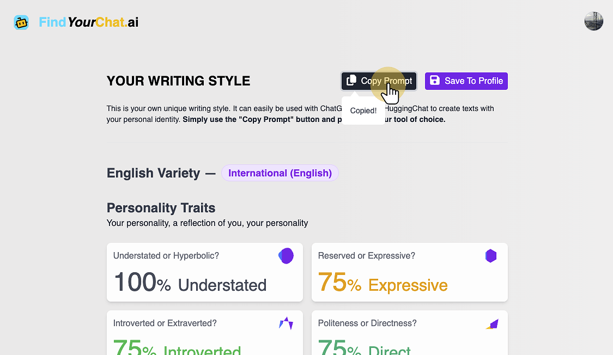

# Guide on using FindYourChat.ai with Gemini

This tutorial provides guidance on using your own FindYourChat.ai Writing Style prompts with Google Gemini.

### 1. Obtain the Prompt from FindYourChat.ai

Copy the prompt from the result or profile page on [FindYourChat.ai](https://www.findyourchat.ai/)

### 2. Connect and Log in to Gemini

Go to [Gemini](https://gemini.google.com/app) and initiate a new conversation

### 3. Paste your Prompt into Gemini

After using the "Copy Prompt" button on FindYourChat.ai, you can simply paste it (ctrl+v, cmd+v) into Gemini

### 4. Replace the content section with your instructions

Describe the content you want to generate. Generally, providing more precise instructions will yield better results. Here are some ideas for instructions:

- Specify the target audience
- Specify the medium (e.g., blog post, professional presentation, social media, ...)
- Specify the desired length of the generated text (e.g., "2 paragraphs," "3 lines," ...)

## 5. Obtain a response tailored to your unique writing style

