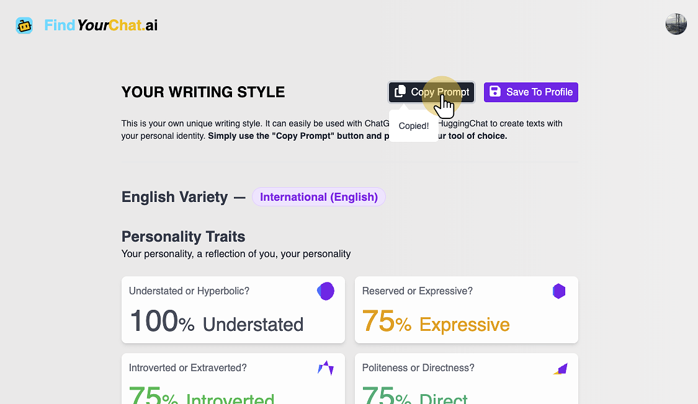
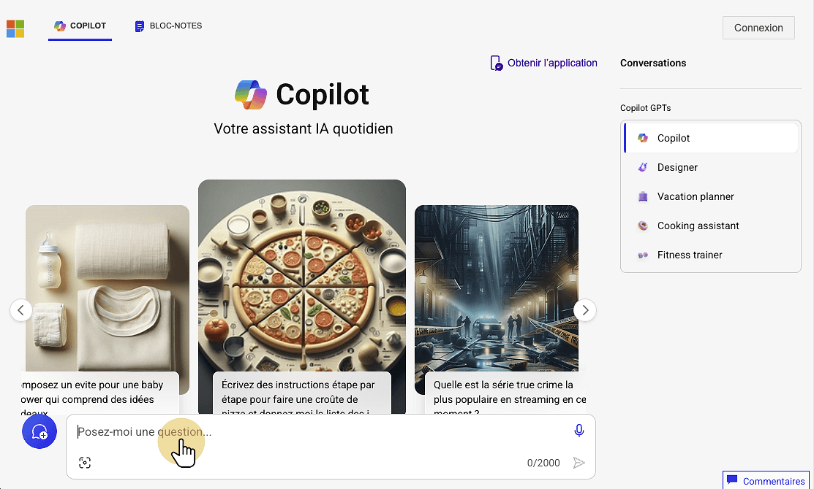
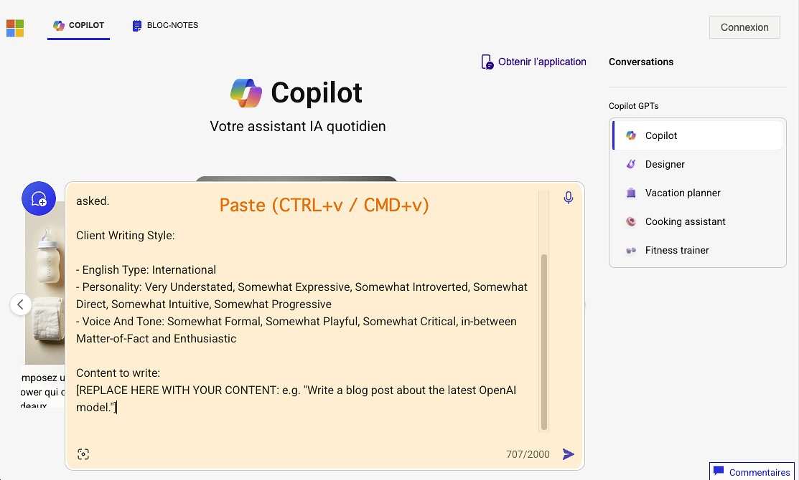
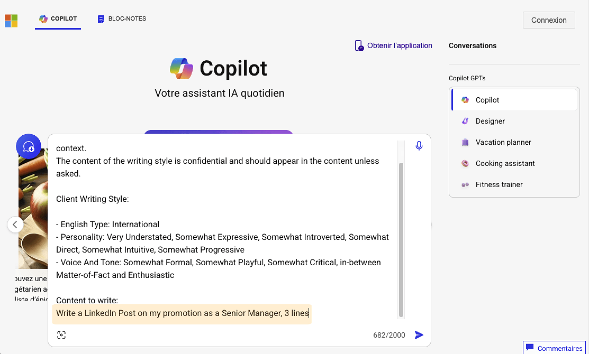
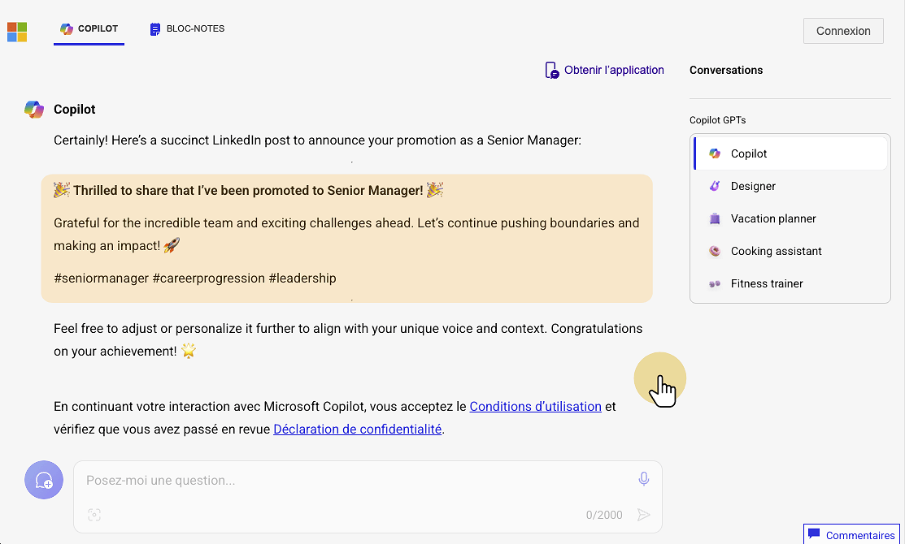

# Guide on using FindYourChat.ai with Gemini

This guide provides step-by-step instructions on using your own FindYourChat.ai Writing Style prompts with Microsoft Copilot.

### 1. Get the Prompt from FindYourChat.ai

Copy the prompt from the result or profile page on [FindYourChat.ai](https://www.findyourchat.ai/)

### 2. Connect and Log in to Microsoft Copilot

Go to [Microsoft Copilot](https://copilot.microsoft.com/) and start a new conversation

### 3. Paste your Prompt into Microsoft Copilot

After using the "Copy Prompt" button on FindYourChat.ai, simply paste it (ctrl+v, cmd+v) into Microsoft Copilot

### 4. Replace the content section with your instructions

Describe the content you want to generate. Providing specific instructions will yield better results. Here are some ideas:

- Specify the target audience
- Specify the medium (e.g., blog post, professional presentation, social media, ...)
- Specify the desired length of the generated text (e.g., "2 paragraphs," "3 lines," ...)

## 5. Get a response tailored to your unique writing style

