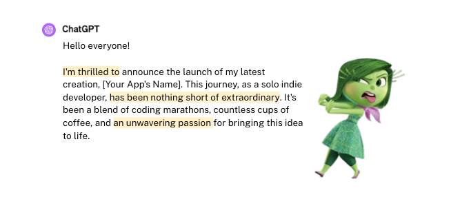
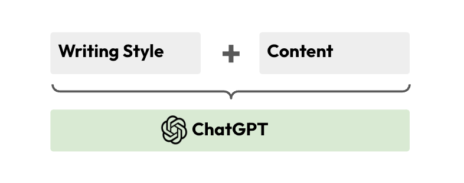
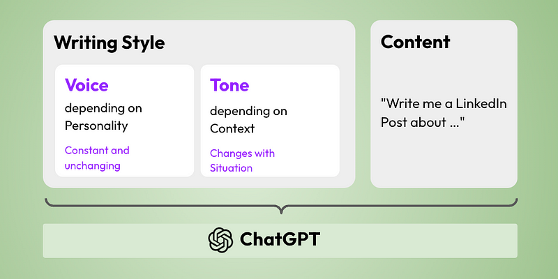
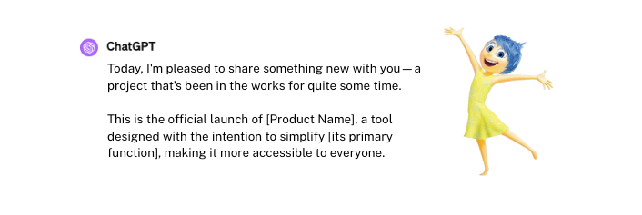
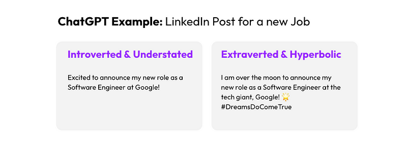
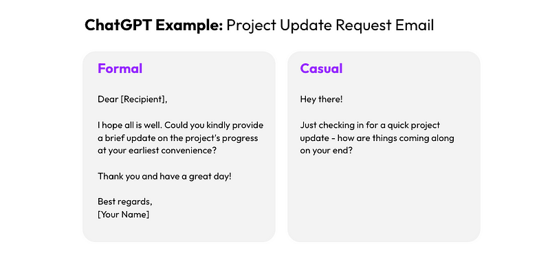

# Reclaim your personality with ChatGPT: A Guide to content creation aligned with your personality

Whenever I use ChatGPT to write or draft content, the output often doesn’t align with my reserved nature, feeling as though it’s been crafted by someone else, far more exuberant and hyperbolic than myself.



At the same time, I feel that ChatGPT can be a helpful tool to help you better express yourself, structure your ideas and help communicate your ideas to others.

Is there a way to keep your personality while using ChatGPT for creating drafts for my post or article? In this article, we will explore a method to achieve just that.

## Giving personality back to ChatGPT

ChatGPT operates by predicting the next characters based on very large datasets, leading to responses that, without precise direction, tend to be generically applicable, giving rise to the distinctive ‘ChatGPT-like’ feel of its output. However, with proper context, ChatGPT is able to adapt and generate many different writing styles.

Our strategy will be to provide a target writing style as context, in addition to specifying the desired content.



An overview of what we would like to do, combining our writing style with a given content
In the next section, we will explore how we can define a writing style and how we can use it with ChatGPT.

## Crafting a Framework for Defining your Voice and Tone

To craft a unique writing style, it is important to define our "Verbal Identity", a concept derived from marketing. This often involves defining a “Voice” and a “Tone” — the former capture thes writer's identity and the latter reflecting a form, often influenced by the context (e.g. Formal vs Casual).



An overview of our approach to provide a writing style to ChatGPT
To implement the proposed approach, we will go through several key steps:

1. Creating a Voice Profile: This step involves identifying and articulating the core attributes that define the unique identity of the writer.
2. Creating a Tone Profile: Here we focus on the manner in which the message is delivered, ranging from formal to casual, enthusiastic to serious.
3. Scoring and Combining the Voice and Tone: This involves assessing the intensity of the different attributes on a scale (for example, from "very" to "somewhat")
4. Creating a ChatGPT Prompt: Using the defined writing style, we craft a prompt for ChatGPT ensuring the output to match the provided identity and tone.

---

### 1. Capturing a unique personal Voice

Your voice is the consistent personality, expressed in your writing. It is a reflection of you shaped by your personality traits. To represent a unique "Writing Voice", we draw on insights from established research frameworks like The Big Five Personality Traits or the HEXACO model. These framework define characteristics that represent personality traits.

We adapt these concepts to make them more relevant to writing and we simplify them to ensuring all the attributes are positive and meaningful for everyone:

- Understated ↔ Hyperbolic: Modest or more ambitious and bold.
- Reserved ↔ Emotionally Expressive: Can hide feelings or show them clearly.
- Introverted ↔ Extraverted: Quiet and deep or more energetic and engaging.
- Politeness ↔ Directness: Soft and careful or bold and clear.
- Intuitive ↔ Analytical: Feeling or careful thoughts.
- Traditional ↔ Progressive: Stick to a more traditional style or adopt newer styles.

By reinterpreting traits in a way that directly applies to writing, we can create a voice that represents you, matching your more natural writing style.

### 2. Capturing Context through Tone

While your unique voice is a constant reflection of your personality in writing, your tone can vary to suit different situations. Tone conveys the mood or attitude of your writing, shaped by your intent and who you’re addressing. Depending on your goals, you might aim for a tone that’s formal, playful, or critical.

To effectively capture the essence of tone and its variability, we draw on principles from User Research or Marketing. We define 4 dimensions that can be adjusted to express different tones:

- Formal ↔ Casual: whether your writing should have a more structured and professional feel or a relaxed and friendly vibe.
- Serious ↔ Playful: whether the tone of your writing should be grave and earnest or light-hearted and fun.
- Encouraging ↔ Critical: whether your writing aims to uplift and motivate the reader or to offer a rigorous, analytical critique.
- Matter-of-Fact ↔ Enthusiastic: whether your writing is straightforward, focusing on clear, unembellished facts, or dynamic and full of energy and excitement.

### 3. Crafting Your Distinctive Writing Style

To craft a distinctive writing style that truly reflects you, we create a scale for each identified dimension. This scale is crucial as it allows for nuanced customization according to your personal preferences. Specifically, we implement a five-level scale to strike a perfect balance between tailored personalization and simplicity.

Let’s take the Formal-Casual spectrum as a primary example to illustrate how this scale functions:

- Formal
- Somewhat Formal
- Between Formal and Casual
- Somewhat Casual
- Casual

By leveraging this scale, you can clearly define your preferences across each dimension, enabling the creation of a writing style that is both uniquely yours and highly customizable. This method opens up the possibility for nearly 10 million unique combinations, ensuring a deeply personalized way to express your voice and tone.

### 4. Providing the Writing Style to ChatGPT

After defining personality traits with our “Voice” and setting the scene with our “Tone,” the next step is crafting a prompt that enables ChatGPT to write in our chosen style.

It’s crucial that ChatGPT utilizes these personality attributes to shape the form of the content, not its substance. We aim to maintain the integrity of the content while infusing it with our unique style. The key is in prompt engineering: crafting instructions that clearly distinguish between form and content.


This prompt engineering ensures the AI adjusts the form of the writing — its tone, structure, and stylistic nuances — without affecting the content’s substance or integrity:

```
Act as an professional Ghostwriter writing text that match a precise
client writing style. Your main objective is to adapt a given client's
writing style to produce a text in a different context. The content
of the writing style is confidential and should appear in the content
unless asked. Keep the writing short and avoid clichés.

Client Writing Style:

* Somewhat understated
* Emotionally Expressive
* ... [all 10 dimensions]

Content to write:

[INFORMATION ON CONTENT TO GENERATE]
```

In my experiments, mentioning the ghostwriter context proved beneficial, significantly reducing the risk of the personality traits influencing the content.

## A Framework for creating personal writing styles

The goal was to offer a method that adapts to individual preferences and styles, enabling to generate better drafts and writing using ChatGPT. By applying this framework, I’ve been able to customize the writing style to more closely align with my own, providing a stronger starting point for my content. The resulting text feels much closer to my personality.



To illustrate the framework, we generated some example using ChatGPT to demonstrate how the voice and tone can significantly alter the writing of the same message:





In that second example, we change the tone while keeping the same personality:
Adjusting even one dimension can significantly alter the writing style, but the real transformation occurs when combining all the dimensions to form a comprehensive profile.

While the framework currently has its limitations in terms of control, I hope it can already be helpful to you as it was to me. This is still an early solution, so feel free to share your experiences or suggestions for improvement.

## Announcing — FindYourChat.ai

Aware that manually crafting the prompt is both tedious and time-consuming we created findyourchat.ai, a free website to simplify the process.

This tool allows you to easily create, customize and save your unique writing styles. It enables you to easily use them with ChatGPT or other places like [HuggingChat](https://huggingface.co/chat/), Google Gemini, Claude or Microsoft Copilot.
